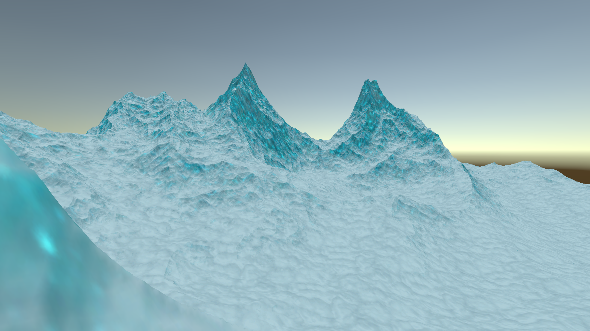
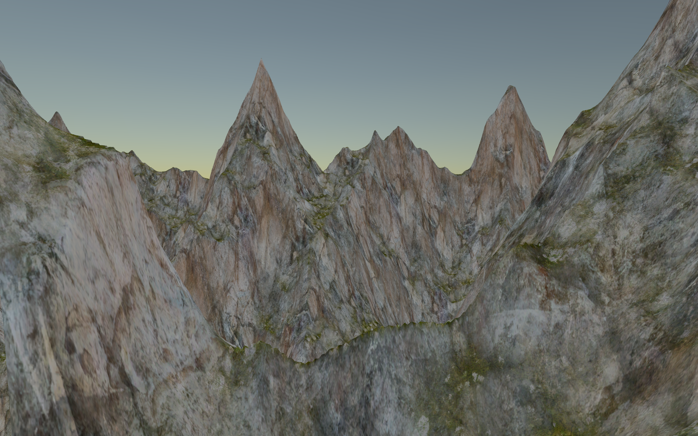
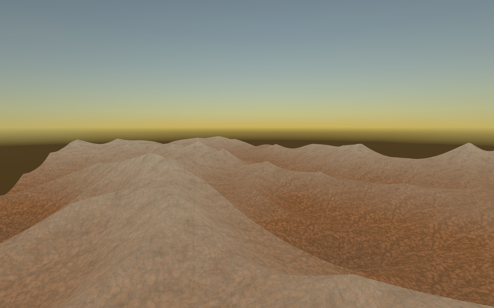
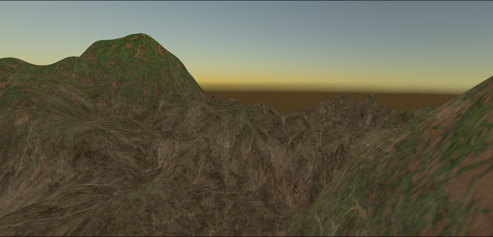

# MountainSim - Procedural Terrain Generator


## Overview

**MountainSim** is a procedural terrain generation tool developed in Unity (URP).

This project began as a personal experiment to explore the mechanics of procedural generation. I wanted to challenge myself to build a terrain system entirely from scratch, to gain a practical understanding of the math and code required to simulate organic landscapes.

This repository serves as a portfolio piece demonstrating graphics programming, custom shader development in HLSL, and modular C# systems architecture.

---

## Key Features

*   **Algorithmic Generation:** Implements core noise algorithms (Perlin, fBm, and Ridged Multifractal) to generate height data programmatically, all built from scratch.
*   **Runtime Mesh Construction:** Dynamically builds 3D geometry (vertices, triangles, UVs) on the CPU, based on generated data.
*   **Custom Shaders:** Features bespoke HLSL shaders written for the Universal Render Pipeline (URP) to handle height based texture blending and terrain coloring.
*   **Interactive Simulation:** Allows users to modify generation parameters, such as seed, octaves, and lacunarity, and see the mesh update.
*   **Free-Roaming Camera:** Includes a smooth camera system for exploring the generated terrain from any angle, as well as camera tools at the users disposition, such as mesh rotation and camera locking.
---

## Technical Implementation

### Core Generation Logic
The heart of the simulation lies in `Assets/Scripts/Terrain`.
*   **`PerlinNoise.cs`**: Implements the fundamental Perlin noise algorithm, utilizing gradient vectors and quintic interpolation to produce smooth, organic patterns.
*   **`FbmNoise.cs`**: Implements Fractal Brownian Motion by layering multiple octaves of Perlin noise to create detailed, natural looking topography.
*   **`NoiseRenderer.cs`**: Converts abstract noise data into physical Unity Meshes. It manages vertex positioning, normal recalculation, and supports high density meshes by dynamically adjusting indexing formats.

### Graphics & Shaders
Rendering is handled using URP with custom shaders located in `Assets/Shaders`.
*   **`HeightBlend.shader`**: A custom shader that blends textures based on vertex height. It efficiently transitions between layers (like rock, grass, and snow) directly on the GPU, avoiding the overhead of generating massive texture maps.
*   **`GradBlend.shader`**: This shader performs gradient based texture blending,  utilizing surface normal data to smoothly transition between different terrain materials based on the steepness of the terrain.

### Architecture
The project is structured to be modular and data-driven.
*   **ScriptableObjects**: Configuration data (like terrain parameters) is managed using ScriptableObjects (`Parameters.cs`, `Settings.cs`). This decouples the data from the logic, making it easier to manage state and adjust settings without recompiling code.

---

## Future Outlook

Looking ahead, I plan to release **MountainSim** on Steam in January 2026. This transition to a public platform will involve further polishing, key optimizations, and potential feature additions.

## Project Structure

```text
MountainSim/
├── Assets/
│   ├── Scripts/
│   │   ├── Terrain/       # Noise algorithms and mesh generation
│   │   ├── Shaders/       # Custom HLSL shader code
│   │   ├── UI/            # User Interface logic
│   │   └── Camera/        # Camera movement systems
│   ├── Scenes/            # Entry point: MountainGeneration
│   └── Settings/          # ScriptableObject configurations
```

## Gallery







## License

This project is open-source and licensed under the MIT License.

---

*Created by Dany Diab*